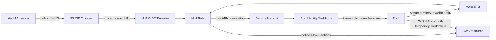

# local-irsa

`local-irsa` is a CLI for trying AWS IRSA-style WebIdentity
authentication on a local Kubernetes cluster.

It is built for development environments. It is not a complete production
operations tool.

`local-irsa` helps with these resources:

- a kind API server OIDC configuration snippet;
- an OIDC issuer on S3;
- an IAM OIDC Provider;
- an IAM Role for a Kubernetes ServiceAccount;
- IRSA annotations on the ServiceAccount.

It does not create or delete kind clusters. It also does not create, store, or
copy the private signing key for ServiceAccount tokens. The signing key stays
inside the kind control plane. `local-irsa` reads the public JWKS from the
Kubernetes API and publishes it to the S3 issuer.

## Architecture



`init` decides the issuer URL and prints the kind snippet. `install` publishes
the cluster JWKS to S3 and creates the IAM OIDC Provider. `bind` creates an
IAM Role and annotates a ServiceAccount. The webhook lets Pods use WebIdentity
credentials through AWS STS. The documented command form is
`go tool local-irsa ...`, which keeps the tool version pinned in your
project's `go.mod`. The Pod then uses temporary credentials to call AWS
resources allowed by the IAM Role policies. See
[Architecture](docs/manual/architecture.md) for the detailed flow and safety
model.

## Prerequisites

You need:

- Go;
- kind;
- kubectl;
- a Docker-compatible container runtime;
- AWS credentials with access to IAM, S3, and STS.

If you install the webhook, the target cluster must already have cert-manager.
`go tool local-irsa install` does not install cert-manager.

## Install

Add `local-irsa` to your project's Go tool dependencies with a release tag.

```text
go get -tool github.com/appthrust/local-irsa/cmd/local-irsa@<version>
go tool local-irsa --help
```

Use a concrete `<version>` for repeatable setup. This records the tool version
in your project's `go.mod`.

## Quick Start

Create the local-irsa state and kind configuration snippet.

```text
go tool local-irsa init --name <name> --region <region> --profile <profile>
```

Merge the generated kind snippet into your kind configuration, then create the
cluster yourself.

```text
kind create cluster --config <your-kind-config>
```

Install the S3 issuer and IAM OIDC Provider.

```text
go tool local-irsa install --name <name> --profile <profile>
```

For a small end-to-end check, create the demo policy.

```text
go tool local-irsa demo create-policy --name <name> --profile <profile>
```

Use the printed policy ARN to bind the demo ServiceAccount.

```text
go tool local-irsa bind \
  --name <name> \
  --namespace default \
  --service-account local-irsa-demo \
  --role-name local-irsa-<safeName(name)>-demo \
  --policy-arn <policyARN> \
  --create-service-account \
  --profile <profile>
```

Run the demo Pod.

```text
go tool local-irsa demo run --name <name>
```

Clean up the AWS and Kubernetes resources after testing.

```text
go tool local-irsa unbind --name <name> --namespace default --service-account local-irsa-demo --profile <profile>
go tool local-irsa demo delete-policy --name <name> --profile <profile>
go tool local-irsa down --name <name> --delete-bucket --yes --profile <profile>
```

## Resource Model

`install` publishes the OIDC discovery document and JWKS to S3:

```text
https://<bucket>.s3.<region>.amazonaws.com/.well-known/openid-configuration
https://<bucket>.s3.<region>.amazonaws.com/keys.json
```

These two objects are public read. Other objects are not made public by
`local-irsa`.

`bind` creates or updates one IAM Role and writes the role ARN to one
ServiceAccount. One ServiceAccount has one role ARN. To grant more AWS
permissions, attach more managed policy ARNs to the same role.

## Cleanup

`local-irsa` creates AWS resources, so clean them up after testing.

- Use `unbind` to remove one ServiceAccount binding and its IAM Role.
- Use `down` to remove local-irsa managed resources for the cluster.
- Add `--delete-bucket` to `down` when you also want to delete the S3 bucket.
- Use `demo delete-policy` to remove the demo customer managed policy.

## Documentation

- Quick start: [docs/manual/quick-start.md](docs/manual/quick-start.md)
- User manual overview: [docs/manual/overview.md](docs/manual/overview.md)
- Architecture: [docs/manual/architecture.md](docs/manual/architecture.md)
- Development setup: [docs/development/setup.md](docs/development/setup.md)
- Design: [docs/design/local-irsa.md](docs/design/local-irsa.md)
