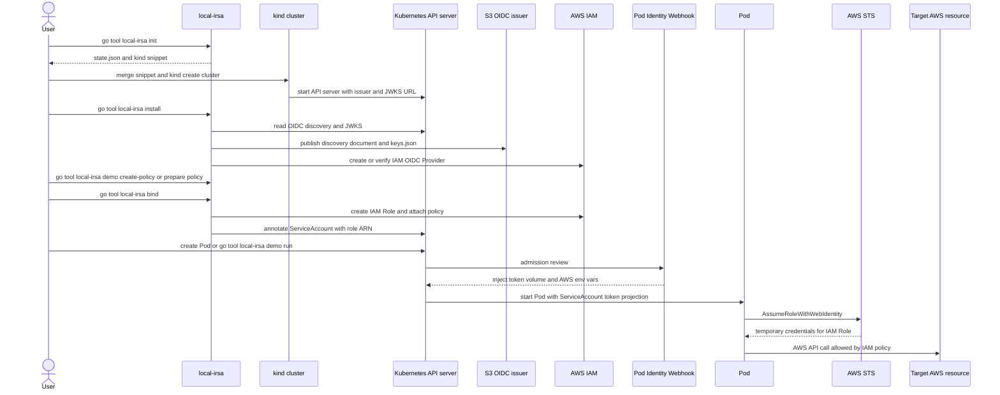
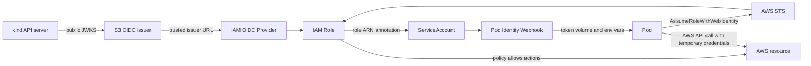

# local-irsa Design

## Purpose

`local-irsa` is a CLI tool that lets a local Kubernetes cluster use AWS IRSA-style WebIdentity authentication.

This tool does not own `kind` cluster creation or deletion. It manages the config snippet that users add to their own `kind` config, the OIDC issuer on S3, the IAM OIDC Provider, IAM Roles, and ServiceAccount annotations.

`local-irsa` does not generate, store, or distribute the private signing key for ServiceAccount tokens. The signing key is managed by `kind` and kubeadm inside the control plane. `local-irsa` reads the public JWKS from the Kubernetes API and publishes it to the S3 issuer.

This tool is a development-environment tool. Full production operations are out of scope.

## Basic Flow

The supported flow is:

```text
init
  -> user merges kind config snippet
  -> user runs kind create cluster
install
bind
doctor
down
```

`local-irsa` does not run `kind create cluster`, `kind delete cluster`, or install cert-manager.

For small verification, after `install`, users can run `demo create-policy` to create a minimal demo policy, run normal `bind`, and then run `demo run` to start an AWS CLI Pod. Policies created by this demo flow can be deleted by `demo delete-policy`.

## Documentation Structure

`docs/manual` and `docs/development` are managed as page files that can be reused directly in a documentation site. They are not combined into one `local-irsa.md` file. `docs/manual/local-irsa.md` and `docs/development/local-irsa.md` are removed, and their content is moved into the split files.

The body text, H1 headings, navigation labels, and link text in `docs/manual` and `docs/development` are written in English. They must not contain Japanese prose. Commands, flags, file paths, AWS and Kubernetes resource names, and product names are kept as they are.

Each page file covers one reader goal. A page must not depend on the body text of another page to explain its basic context. The H1 of each page matches the English navigation label. H2 and lower headings are used only as helper structure inside the page.

`docs/manual` is user-facing operating documentation. Its readers are users who want to try AWS IRSA-style WebIdentity authentication on a local Kubernetes cluster. It does not contain information for repository developers, maintainers, CI, code generation, release work, or design reconciliation.

`docs/manual` has this file structure:

```text
docs/manual/
  overview.md
  irsa-background.md
  architecture.md
  installation.md
  quick-start.md
  help-and-output.md
  state-and-aws.md
  kind.md
  commands/
    init.md
    install.md
    bind.md
    unbind.md
    demo.md
    doctor.md
    down.md
  troubleshooting.md
```

The manual navigation order is:

1. Overview
2. IRSA Background
3. Architecture
4. Installation
5. Prerequisites
6. Quick Start
7. Help and Output
8. State and AWS Settings
9. `init`
10. Create a kind Cluster
11. `install`
12. `bind`
13. `unbind`
14. Demo
15. `doctor`
16. `down`
17. Troubleshooting

`overview.md` covers Overview. `irsa-background.md` covers IRSA Background. `architecture.md` covers Architecture. `installation.md` covers Installation and Prerequisites. `quick-start.md` covers Quick Start. `help-and-output.md` covers Help and Output. `state-and-aws.md` covers State and AWS Settings. `kind.md` covers Create a kind Cluster. `commands/*.md` covers each command reference. `troubleshooting.md` covers Troubleshooting.

The manual Overview explains what `local-irsa` creates, that it targets development environments, what it does not support, and that it does not handle the private signing key for ServiceAccount tokens. Installation shows the user-facing default setup method as a project-pinned Go tool dependency: `go get -tool github.com/appthrust/local-irsa/cmd/local-irsa@<version>`, followed by `go tool local-irsa ...`. It does not use `go install` as the main path and does not show development commands such as `go run` or `go install ./cmd/local-irsa`. Prerequisites covers kind, kubectl, a container runtime, AWS credentials, IAM/S3/STS permissions, policies that must already exist, and cert-manager when the webhook is used.

The manual IRSA Background page explains IRSA concepts for readers who do not already know AWS IRSA. It explains Kubernetes ServiceAccounts and projected ServiceAccount tokens, OIDC issuer and discovery documents, JWKS, token `sub` and `aud` claims, AWS IAM OIDC Providers, `sts:AssumeRoleWithWebIdentity`, IAM Role trust policy conditions, and why IRSA avoids putting long-lived AWS credentials in Pods. It also explains how EKS IRSA and local-irsa differ: EKS provides the issuer and integration in the managed control plane, while local-irsa publishes a local cluster issuer through S3 and configures kind explicitly.

The IRSA Background page stays product-neutral enough to teach the underlying authentication model, but it uses local-irsa terms where they help the reader connect the concept to the rest of the manual. It links forward to `architecture.md` and does not repeat command usage or setup steps.

The manual Architecture page explains how the local Kubernetes cluster, S3 issuer, IAM OIDC Provider, IAM Role, ServiceAccount annotation, webhook, Pod, AWS STS, and target AWS resources work together. It includes a detailed diagram and a step-by-step narrative for `init`, kind cluster creation, `install`, `bind`, Pod runtime authentication, and the Pod's AWS API calls to the resources allowed by the attached IAM policies. It also explains that `local-irsa` does not hold the ServiceAccount private signing key, that `/.well-known/openid-configuration` and `/keys.json` are public S3 objects, why IAM trusts the S3 issuer URL, and how `aud` / `sub` trust policy conditions restrict the role to one ServiceAccount.

The manual Architecture page also includes a Mermaid sequence diagram that shows the user-visible command sequence and the runtime AWS credential exchange. The sequence diagram includes `go tool local-irsa init`, the user merging the kind snippet, `kind create cluster`, `go tool local-irsa install`, optional `go tool local-irsa demo create-policy` or a pre-created IAM policy, `go tool local-irsa bind`, Pod creation or `go tool local-irsa demo run`, webhook mutation, `AssumeRoleWithWebIdentity`, and the Pod calling the target AWS resource allowed by the IAM Role policies. The diagram has this level of detail:



The Architecture page also explains the safety model at a user-understandable level: random `issuerID`, S3 bucket owner verification, local-irsa ownership tags, and the `down --delete-bucket` rule that deletes the bucket only after IAM OIDC Provider cleanup. It links to command reference pages instead of repeating all flags.

Quick Start is not just a basic flow explanation. It is a hands-on path where the user reaches a successful WebIdentity authentication check from an AWS CLI Pod by using `demo run`. The end state is that `aws sts get-caller-identity` succeeds inside the Pod and shows that the IAM Role created by `local-irsa` is used. Quick Start shows this order:

```text
go tool local-irsa init
  -> merge the generated kind config snippet into your kind config
  -> kind create cluster
go tool local-irsa install
go tool local-irsa demo create-policy
go tool local-irsa bind
go tool local-irsa demo run
go tool local-irsa unbind
go tool local-irsa demo delete-policy
go tool local-irsa down
```

Quick Start does not repeat detailed flag reference. It shows copy-ready representative commands, expected successful results, cleanup order, and links to detailed pages. `demo` is part of the quick start path. `manual/commands/demo` is a detailed reference for `demo create-policy`, `demo run`, and `demo delete-policy`.

Manual command sections are written so users can run the commands directly. Each command section explains purpose, prerequisites, representative command, required flags, resources that are created or changed, next steps after success, and common failure cases, in that order. The webhook is a subsection inside `install`, not a separate top-level page. `demo` is a helper for small end-to-end verification, not a replacement for normal commands.

State and AWS Settings covers the state directory, state file, generated helper files, AWS region and profile resolution, ownership tags, and the public S3 issuer objects. The full `state.json` schema is design-owned, so the manual explains only the location, stored content, and deletion rules that users need to understand.

Troubleshooting is grouped by symptom. Each item briefly shows what happened, common causes, and a command to check or fix the issue. Implementation debugging, stack trace reading, and developer-focused debugging belong in `docs/development`.

`docs/development` is repository developer documentation. Its readers are people who change the `local-irsa` code, Taskfile, kind fixture, CI, or public documentation before release. It does not duplicate user-facing command reference. It links to the manual page that owns the detail.

`docs/development` has this file structure:

```text
docs/development/
  setup.md
  tasks.md
  verification.md
```

The development navigation order is:

1. Intended Audience
2. Development Environment
3. CLI Installation and Local Runs
4. Development Tasks
5. Environment Variables
6. AWS Verification
7. Manual Verification
8. Regular Checks

`setup.md` covers Intended Audience, Development Environment, and CLI Installation and Local Runs. `tasks.md` covers Development Tasks and Environment Variables. `verification.md` covers AWS Verification, Manual Verification, and Regular Checks.

Development Environment covers the Go version, devbox, Taskfile, kind, kubectl, container runtime, and network prerequisites. CLI Installation and Local Runs separates the user-facing `go get -tool` / `go tool local-irsa` flow, optional personal binary install with `go install`, developer `go install ./cmd/local-irsa`, and temporary `go run ./cmd/local-irsa`. Development Tasks defines the responsibility of `task install`, `task check`, `task up`, and `task down`, and states that `task up` does not run `local-irsa init`, merge snippets, `install`, `bind`, `doctor`, or `down`.

AWS Verification and Manual Verification explain that developers use their own AWS account and profile. Public docs must not fix a personal AWS account ID, profile name, bucket name, or issuer URL. They use placeholders such as `<accountID>`, `<profile>`, `<bucket>`, and `<issuerURL>`. If a maintainer-only verification account exists, its real values live in an untracked local note or private maintainer document, not in the public repository.

To keep the docs ready for a documentation site, manual and development docs follow these rules:

- Headings are English task names or concept names that readers search for.
- H2 order moves from first-use guidance to reference and then troubleshooting.
- Cross-links use repository-relative paths, not local absolute paths or line-number links.
- Command examples are copy-ready and do not include shell prompts.
- Output examples, AWS account IDs, profile names, bucket names, issuer URLs, Role ARNs, tokens, and secrets use placeholders or redacted values.
- Code fences use `text`, `sh`, `yaml`, or `json` according to the content.
- Design history, feedback processing, and open decision discussion are not included. If an open item must appear in public docs, it is written as a current user-facing constraint.

## OSS Public Files

Before OSS release, the repository root and `.github` directory contain the public files needed for users, evaluators, contributors, and security reporters. These files are not runtime behavior of `local-irsa`; they are a public contract.

The required files before release are:

- `README.md`
- `LICENSE`
- `SECURITY.md`
- `CONTRIBUTING.md`
- `CODE_OF_CONDUCT.md`
- `CHANGELOG.md`
- `.github/workflows/ci.yml`
- `.github/ISSUE_TEMPLATE/bug_report.yml`
- `.github/ISSUE_TEMPLATE/feature_request.yml`
- `.github/pull_request_template.md`
- `.gitignore`

Responsibility for these files is split as follows:

- The implementer handles `.gitignore` and `.github/workflows/ci.yml`. These are build and config surfaces.
- Documentation work handles `README.md`, `CONTRIBUTING.md`, `CHANGELOG.md`, `.github/ISSUE_TEMPLATE/bug_report.yml`, `.github/ISSUE_TEMPLATE/feature_request.yml`, and `.github/pull_request_template.md`.
- Maintainer decision covers final confirmation of `LICENSE`, the private contact for `SECURITY.md`, and the enforcement contact for `CODE_OF_CONDUCT.md`.
- `SECURITY.md` and `CODE_OF_CONDUCT.md` are not complete until a public contact that can actually respond is decided.

`README.md` is the first entry point on GitHub, so it is written in English. The pages in `docs/manual` and `docs/development` are also English and are linked from the README.

`README.md` contains at least:

- That `local-irsa` is a CLI for trying AWS IRSA-style WebIdentity authentication on a local Kubernetes cluster.
- That it is for development environments and is not a complete production operations tool.
- A small architecture diagram and short explanation that shows the local cluster, S3 OIDC issuer, IAM OIDC Provider, IAM Role, ServiceAccount, webhook, Pod, AWS STS, and target AWS resource relationship.
- Main prerequisites: Go, kind, kubectl, a Docker-compatible container runtime, and AWS credentials.
- The user-facing setup method: `go get -tool github.com/appthrust/local-irsa/cmd/local-irsa@<version>`.
- The user-facing run method: `go tool local-irsa <subcommand> ...`.
- The shortest path: `go tool local-irsa init`, merge kind config, `kind create cluster`, `go tool local-irsa install`, `go tool local-irsa demo create-policy`, `go tool local-irsa bind`, `go tool local-irsa demo run`, `go tool local-irsa unbind`, `go tool local-irsa demo delete-policy`, and `go tool local-irsa down`.
- That `install` manages the S3 issuer and IAM OIDC Provider, and `bind` manages IAM Role and ServiceAccount annotation.
- That the S3 issuer discovery document and JWKS are public read.
- That `local-irsa` does not generate, store, or distribute the private signing key for ServiceAccount tokens.
- That AWS resources are created and must be cleaned up with `unbind`, `down`, and `demo delete-policy` after verification.
- Links to `docs/manual/quick-start.md`, `docs/manual/overview.md`, `docs/manual/architecture.md`, `docs/development/setup.md`, and `docs/design/local-irsa.md`.

The README architecture diagram is concise and uses Mermaid so GitHub can render it. It has this level of detail:



The README text under the diagram stays short. It explains that `init` decides the issuer URL and kind snippet, `install` publishes the cluster JWKS to S3 and creates the IAM OIDC Provider, `bind` creates an IAM Role and annotates a ServiceAccount, and the webhook lets Pods use WebIdentity credentials through AWS STS. It also shows that the Pod uses the temporary credentials to call the AWS resources allowed by the IAM Role policies. It explains that the documented command form is `go tool local-irsa ...`, which keeps the tool version pinned in the user's project `go.mod`. It links to `docs/manual/architecture.md` for the detailed explanation.

Examples in `README.md`, manual docs, development docs, issue templates, and pull request templates use placeholders for AWS account IDs, profile names, bucket names, and issuer URLs. Public docs must not fix a maintainer's personal AWS account ID, profile name, bucket name, or issuer URL.

`LICENSE` is Apache License 2.0. The root `LICENSE` file contains the standard Apache License 2.0 text before public release. If the license changes, this design is updated before the change.

`SECURITY.md` is the vulnerability reporting entry point. It contains at least:

- Supported version policy.
- A rule that vulnerabilities are sent to a private contact, not a public issue.
- A policy that issues about AWS credentials, ServiceAccount tokens, OIDC issuer takeover, IAM trust policies, and S3 bucket policies are treated as security reports.
- What information may be included in reports and what secrets must not be pasted.
- Expected first response time.

`SECURITY.md` contains a contact that can actually receive reports before release. The project must not be released as OSS without this contact.

The private contact for security reports is decided by the maintainer before release. Design, implementation, and documentation reconciliation must not infer the contact from a git signature or a local environment. If the contact is not decided, `SECURITY.md` remains an incomplete pre-release blocker.

`CONTRIBUTING.md` describes contribution flow. It includes at least:

- Development uses Go 1.26 or later, devbox, and Taskfile.
- Initial setup uses `task install`; verification uses `task check`.
- Manual kind verification starts by copying `kind.dist.yaml` to `kind.yaml`, then uses `task up` and `task down`.
- AWS end-to-end verification is optional and uses each contributor's own AWS account and permissions.
- PRs that change behavior include manual or design updates.
- Security issues are sent through the `SECURITY.md` contact, not public issues.

`CODE_OF_CONDUCT.md` is based on Contributor Covenant 2.1. The contact field is replaced before release with a contact that can actually respond.

The Code of Conduct enforcement contact is decided by the maintainer before release. The maintainer also decides whether it can be the same as the security report contact or must be separate. If the contact is not decided, `CODE_OF_CONDUCT.md` remains an incomplete pre-release blocker.

`CHANGELOG.md` records changes by release tag. At first release, it has `Unreleased` and the first release heading. It records user-facing changes to CLI flags, output, AWS and Kubernetes resources, and cleanup behavior.

`.github/workflows/ci.yml` runs on pull requests and pushes to the default branch. CI uses Go 1.26 and at least runs `task check`. CI must not require AWS credentials, a kind cluster, Docker daemon, or external AWS resources.

Issue templates use GitHub Issue Forms. `bug_report.yml` has fields for reproduction steps, expected result, actual result, `local-irsa version`, OS, Go version, Kubernetes version, kind version, kubectl context type, and redacted error output. It warns users not to paste AWS credentials, ServiceAccount tokens, web identity tokens, or secret access keys. `feature_request.yml` has fields for the problem, proposed use, alternatives, and related AWS or Kubernetes assumptions.

`.github/pull_request_template.md` has at least this checklist:

- `task check` was run.
- Manual or design docs were updated when CLI behavior changed.
- Cleanup and safety were checked when AWS, Kubernetes, S3, or IAM create/delete behavior changed.
- Output examples do not include credentials, tokens, personal AWS account IDs, or personal profile names.

`.gitignore` excludes at least:

```text
/.DS_Store
/.devbox/
/.local-irsa-dev/
/.impl/
/.env
/kind.yaml
/local-irsa
/coverage.out
/dist/
*.test
```

`docs/design-feedback` is an internal inbox for design reconciliation. It is not a public user-facing product file. Before OSS release, resolved feedback files are removed from the public tree. Unresolved feedback is either moved to normal GitHub issues or reflected into design and closed before release.

These files are not required for the first OSS release:

- `.github/dependabot.yml`
- `.github/CODEOWNERS`
- `NOTICE`
- `SUPPORT.md`

If dependency license review shows that `NOTICE` is needed, `NOTICE` is added before release.

## CLI Installation

The default user-facing setup method in the manual is Go tool dependency management. Users add `local-irsa` to the current module with `go get -tool`, then run it with `go tool local-irsa`.

```text
go get -tool github.com/appthrust/local-irsa/cmd/local-irsa@<version>
go tool local-irsa --help
```

`<version>` is a release tag. The manual tells users to use a concrete version instead of `@latest` for repeatability. This flow records the tool in the user's `go.mod`, so a project can pin and share the `local-irsa` version.

The manual explains that `go tool` requires a Go module. If the user is not already in a module, the manual shows a small working directory flow:

```text
mkdir local-irsa-work
cd local-irsa-work
go mod init local-irsa-work
go get -tool github.com/appthrust/local-irsa/cmd/local-irsa@<version>
go tool local-irsa --help
```

All README and manual quick-start examples use `go tool local-irsa ...` as the command form. The standalone binary name is still `local-irsa`, but direct binary execution is not the main documentation path.

`go install` may be mentioned only as a secondary personal-install option for users who intentionally want a global binary outside a project `go.mod`.

```text
go install github.com/appthrust/local-irsa/cmd/local-irsa@<version>
```

Developers who checked out the repository can install the development build from the repository root:

```text
go install ./cmd/local-irsa
```

`go install` follows standard Go behavior and writes the binary to `$GOBIN` or `$GOPATH/bin`. This behavior is explained only in the secondary personal-install option or development documentation, not as the main user-facing setup path.

Temporary development runs can use:

```text
go run ./cmd/local-irsa <subcommand> ...
```

This is not the default user-facing manual flow. It belongs in developer documentation.

Release binaries, package managers, and container-image installation are not defined in this design yet.

## Development Environment Tasks

The repository has `Taskfile.yaml` for developers. The Taskfile separates dependency install, checks, and development-cluster bootstrap.

The Taskfile is a development helper and does not change the `local-irsa` CLI contract. The CLI still does not create or delete `kind` clusters.

The basic development tools are:

- `go` 1.26 or later.
- `task`.
- `kind`.
- `kubectl`.
- A Docker-compatible container runtime.

`task up` fetches the cert-manager manifest, so network access to GitHub Releases is required.

End-to-end checks with AWS also require AWS credentials and IAM, S3, and STS permissions. The `aws` CLI is not required by the implementation.

Developers use their own AWS account and AWS credentials for end-to-end checks. Public docs do not fix profile names or AWS account IDs. They use placeholders such as `<profile>` and `<accountID>`. Real values for a maintainer-only verification AWS account live in an untracked local note or private maintainer document, not in the public repository.

If the webhook is tested, the target cluster needs cert-manager. `task up` installs cert-manager into the development kind cluster. `local-irsa install` does not install cert-manager.

`task up` and `task down` do not automatically verify `local-irsa` commands. Developers manually verify `init`, `install`, `bind`, `doctor`, and `down`.

`task install` downloads Go module dependencies. It does not check for external commands.

`task check` runs Go checks. It runs at least `go test ./...` and `go vet ./...`.

`task up` starts the local-irsa development cluster from the developer-provided `kind.yaml` and prepares the in-cluster prerequisites needed by default `local-irsa install`. It does not download Go module dependencies, run tests, run static checks, run `local-irsa`, merge snippets, check AWS profiles, or create AWS resources.

`task up` does the following:

1. Checks that `kind.yaml` exists.
2. If `kind.yaml` does not exist, fails and prints the steps for `cp kind.dist.yaml kind.yaml` and merging the snippet printed by `local-irsa init`.
3. Creates or reuses the development kind cluster with `kind create cluster --config kind.yaml`.
4. Installs or updates the cert-manager manifest with `kubectl apply`.
5. Waits for the `certificates.cert-manager.io` CRD to become Established.
6. Waits for the `cert-manager`, `cert-manager-cainjector`, and `cert-manager-webhook` deployments in the `cert-manager` namespace to become Available.
7. On success, prints the kind config, kind context, and cert-manager version.

The cert-manager version installed by `task up` is pinned in the repository. The default version is `v1.20.2`. `task up` does not use `latest` tags or unpinned URLs.

The cert-manager manifest URL has this form:

```text
https://github.com/cert-manager/cert-manager/releases/download/<version>/cert-manager.yaml
```

Installing cert-manager is part of development-environment bootstrap. It is not a responsibility of the `local-irsa` CLI.

The cert-manager readiness wait timeout is 120 seconds. If it times out, `task up` fails and tells the user to inspect the state with `kubectl -n cert-manager get pods`.

The repository root has `kind.dist.yaml`. It is a git-managed kind config template and does not include AWS account, bucket, issuer URL, `service-account-issuer`, or `service-account-jwks-uri`. Developers copy `kind.dist.yaml` to `kind.yaml` and, when needed, merge the snippet printed by `local-irsa init` into `kind.yaml`.

`kind.yaml` is a per-developer local config and is not tracked by git. `.gitignore` excludes root `/kind.yaml`.

Whether `task up` creates a cluster with local-irsa OIDC settings depends only on the content of `kind.yaml`. `task up` itself does not run `local-irsa init`, merge snippets, or run `install`.

`task up` and `task down` read `LOCAL_IRSA_DEV_CLUSTER` as the development cluster name. The default value is `local-irsa-dev`. AWS region, AWS profile, and bucket name are not required inputs for `task up`. If the cluster name is overridden, the developer also makes the cluster name in `kind.yaml` match it.

`task down` does the following:

1. Deletes the development `kind` cluster created by `task up`.
2. Does not delete AWS resources.
3. Does not run `local-irsa down`.

`task down` also deletes cert-manager because it deletes the whole kind cluster. It does not clean up local-irsa state, S3 buckets, IAM OIDC Providers, IAM Roles, or ServiceAccount annotations created during manual verification. Developers clean those up by manually running `local-irsa down`.

## Commands

The CLI has these subcommands:

```text
local-irsa init --name NAME [--region REGION] [--bucket BUCKET] [--profile PROFILE]
local-irsa install --name NAME [--context CONTEXT] [--profile PROFILE] [--skip-webhook]
local-irsa bind --name NAME --namespace NS --service-account SA --role-name ROLE --policy-arn ARN... [--context CONTEXT] [--profile PROFILE] [--create-service-account]
local-irsa unbind --name NAME --namespace NS --service-account SA [--context CONTEXT] [--profile PROFILE]
local-irsa doctor --name NAME [--namespace NS --service-account SA] [--context CONTEXT] [--profile PROFILE]
local-irsa down --name NAME [--context CONTEXT] [--profile PROFILE] [--delete-bucket] [--yes]
local-irsa demo create-policy --name NAME [--profile PROFILE]
local-irsa demo run --name NAME [--namespace NS] [--service-account SA] [--context CONTEXT]
local-irsa demo delete-policy --name NAME [--profile PROFILE]
```

Unknown subcommands, missing required flags, validation failures, external command failures, and AWS API failures exit with an error.

## CLI Framework and Help

`local-irsa` uses `github.com/alecthomas/kong` for CLI parsing and help generation.

Kong struct tags define the root command, subcommands, flags, help text, and example text in Go types. Each leaf command has a dedicated struct that clearly defines the input values passed to the command implementation.

Each subcommand has at least:

- A one-line short description.
- Detailed help that explains what it creates, checks, updates, or deletes.
- Representative examples.
- Required and optional flag descriptions.

Root help lets users understand the purpose of `init`, `install`, `bind`, `doctor`, `down`, and `demo` at a glance. Help is user-facing operating guidance. It does not include developer tasks such as `task up` / `task down` or verification-only AWS profiles.

Input validation uses Kong `required` tags and explicit validation before command execution. Validation that depends on multiple flags, such as requiring `--namespace` and `--service-account` together for `doctor`, is command-specific validation.

Cobra, urfave/cli, and Viper are not used. Config-file loading is not in scope, so Viper-like config management is not introduced.

## CLI Progress Output

`local-irsa` shows progress for commands with long-running work. The user can see the current step. At least `init`, `install`, `bind`, `unbind`, `doctor`, `down`, `demo create-policy`, `demo run`, and `demo delete-policy` show progress.

When connected to a TTY, the running step uses a fixed spinner design and is replaced by a status line on completion. In non-TTY output, CI, pipes, and redirects, no spinner is used. A plain status line is printed for each step.

Progress output is concise. Each step starts with a verb and says what is being checked, created, updated, or deleted. AWS credentials, tokens, and secrets are not shown. AWS account ID, region, bucket, issuer URL, IAM Role ARN, and kubectl context may be shown.

The root command has these common flags:

- `--quiet`: hides successful progress output and prints only the final result and needed next steps. Errors and warnings are still printed.
- `--verbose`: prints extra operation targets for AWS, S3, IAM, and kubectl. Secrets are not printed.

Using `--quiet` and `--verbose` together is an error.

TTY output has this fixed design:

- Running spinner frames rotate in this order: `⠋`, `⠙`, `⠹`, `⠸`, `⠼`, `⠴`, `⠦`, `⠧`, `⠇`, `⠏`.
- A running line looks like `⠋ Resolve AWS settings`, with only the frame changing.
- A success line looks like `✓ <step>  <message>`.
- An info line looks like `ℹ <key>  <value>`.
- A warning line looks like `! <message>`.
- A failure line looks like `✗ <step>  <message>`.
- In TTY output, `✓` is green, `ℹ` and the spinner are cyan, `!` is yellow, and `✗` is red.
- If `NO_COLOR` is set, or if output is not a TTY, ANSI color is not used.

The spinner frames, status symbols, colors, and spacing are CLI output contract, not implementation detail. The implementation does not change this design. There is no ASCII fallback.

Progress output is handled through a small abstraction that is independent of the CLI framework.

```go
type Progress interface {
    Start(step string)
    Detail(key string, value string)
    Success(message string)
    Warn(message string)
    Fail(message string)
}
```

The implementation has at least a TTY implementation and a plain text implementation. A spinner library is internal to this abstraction and is not used directly by command business logic.

On error, the output shows the failed step, cause, and a hint when possible. For example, if the cluster issuer does not match, the hint says to merge the snippet generated by `init` into `kind.yaml` and recreate the kind cluster.

On successful `init`, the output shows the state path, kind snippet path, issuer URL, and next steps. On successful `install`, the output shows the S3 issuer objects, IAM OIDC Provider, and webhook status.

Progress lines, warnings, and errors go to standard error. Successful final results and next steps go to standard output.

Detailed diagnostic reports go to standard output. The `doctor` state dump is a diagnostic report, not a progress line.

Step names are stable for each command. At least these step names are used.

`init`:

- `Resolve AWS settings`
- `Get AWS account ID`
- `Decide issuer URL`
- `Write state`
- `Write kind snippet`

`install`:

- `Load state`
- `Check cluster OIDC`
- `Read cluster JWKS`
- `Check webhook prerequisites`
- `Prepare S3 issuer`
- `Publish issuer documents`
- `Ensure IAM OIDC Provider`
- `Apply webhook`
- `Check webhook readiness`
- `Check webhook mutation`

If `--skip-webhook` is set, `install` does not print `Check webhook prerequisites`, `Apply webhook`, `Check webhook readiness`, or `Check webhook mutation`.

`bind`:

- `Load state`
- `Ensure IAM Role`
- `Attach managed policies`
- `Check ServiceAccount`
- `Annotate ServiceAccount`
- `Save binding`

`unbind`:

- `Load state`
- `Find binding`
- `Remove ServiceAccount annotations`
- `Detach managed policies`
- `Delete IAM Role`
- `Save binding`

`doctor`:

- `Load state`
- `Check cluster OIDC`
- `Read cluster JWKS`
- `Check S3 issuer`
- `Check IAM OIDC Provider`
- `Check ServiceAccount binding`
- `Test web identity`

If `--namespace` and `--service-account` are not set, `doctor` does not print `Check ServiceAccount binding` or `Test web identity`.

`down`:

- `Load state`
- `Confirm deletion`
- `Remove ServiceAccount annotations`
- `Delete IAM roles`
- `Delete IAM OIDC Provider`
- `Delete S3 issuer objects`
- `Delete S3 bucket`

If `--yes` is set, `down` does not print `Confirm deletion`. If `--delete-bucket` is not set, `down` does not print `Delete S3 bucket`.

`demo create-policy`:

- `Load state`
- `Resolve AWS account`
- `Ensure demo policy`

`demo run`:

- `Load state`
- `Check ServiceAccount`
- `Run AWS CLI pod`
- `Check injected environment`
- `Check AWS identity`
- `Check IAM Role`
- `Clean up demo pod`

`demo delete-policy`:

- `Load state`
- `Resolve AWS account`
- `Delete demo policy`

In TTY output, the running step rewrites the same line and looks like this:

```text
⠋ Resolve AWS settings
⠙ Resolve AWS settings
⠹ Resolve AWS settings
⠸ Resolve AWS settings
```

TTY output after successful `init` has this fixed shape:

```text
$ local-irsa init --name testing --region ap-northeast-1
✓ Resolve AWS settings  region ap-northeast-1
✓ Get AWS account ID  123456789012
✓ Decide issuer URL  https://local-irsa-123456789012-ap-northeast-1-testing-7f3k6q2m.s3.ap-northeast-1.amazonaws.com
✓ Write state  ~/.local/share/local-irsa/clusters/testing/state.json
✓ Write kind snippet  ~/.local/share/local-irsa/clusters/testing/kind-irsa-snippet.yaml

State:
  path: ~/.local/share/local-irsa/clusters/testing/state.json
Kind snippet:
  path: ~/.local/share/local-irsa/clusters/testing/kind-irsa-snippet.yaml
Issuer:
  url: https://local-irsa-123456789012-ap-northeast-1-testing-7f3k6q2m.s3.ap-northeast-1.amazonaws.com

Next:
  1. Merge the kind snippet into kind.yaml.
  2. Run kind create cluster --config kind.yaml.
  3. Run local-irsa install --name testing.
```

Non-TTY `install` output follows this pattern. It does not rewrite a running line; it appends lines.

```text
$ local-irsa install --name testing --skip-webhook
→ Load state
✓ Load state  ~/.local/share/local-irsa/clusters/testing/state.json
→ Check cluster OIDC
✓ Check cluster OIDC  issuer matches state
→ Read cluster JWKS
✓ Read cluster JWKS  1 key
→ Prepare S3 issuer
✓ Prepare S3 issuer  s3://local-irsa-123456789012-ap-northeast-1-testing-7f3k6q2m
→ Publish issuer documents
✓ Publish issuer documents  /.well-known/openid-configuration, /keys.json
→ Ensure IAM OIDC Provider
✓ Ensure IAM OIDC Provider  arn:aws:iam::123456789012:oidc-provider/local-irsa-123456789012-ap-northeast-1-testing-7f3k6q2m.s3.ap-northeast-1.amazonaws.com

Issuer:
  discovery: https://local-irsa-123456789012-ap-northeast-1-testing-7f3k6q2m.s3.ap-northeast-1.amazonaws.com/.well-known/openid-configuration
  jwks: https://local-irsa-123456789012-ap-northeast-1-testing-7f3k6q2m.s3.ap-northeast-1.amazonaws.com/keys.json
IAM:
  oidc provider: arn:aws:iam::123456789012:oidc-provider/local-irsa-123456789012-ap-northeast-1-testing-7f3k6q2m.s3.ap-northeast-1.amazonaws.com
Webhook:
  status: skipped
```

With `--quiet`, `→`, `✓`, and `ℹ` progress lines are hidden, and only the final result is printed. With `--verbose`, target resources are added as `ℹ` lines on standard error.

```text
$ local-irsa install --name testing --verbose
→ Prepare S3 issuer
ℹ S3 bucket  local-irsa-123456789012-ap-northeast-1-testing-7f3k6q2m
ℹ S3 region  ap-northeast-1
✓ Prepare S3 issuer  s3://local-irsa-123456789012-ap-northeast-1-testing-7f3k6q2m
```

Error output follows this pattern:

```text
✗ Check cluster OIDC  issuer does not match state
Cause: cluster issuer is https://kubernetes.default.svc
Hint: merge ~/.local/share/local-irsa/clusters/testing/kind-irsa-snippet.yaml into kind.yaml and recreate the kind cluster.
```

Webhook prerequisite errors fail before AWS creation, update, or publishing:

```text
✗ Check webhook prerequisites  cert-manager Certificate CRD is required
Cause: kubectl get crd certificates.cert-manager.io returned NotFound.
Hint: install cert-manager in the target cluster or rerun with --skip-webhook.
```

When `down` deletes S3 issuer objects but keeps the bucket because `--delete-bucket` was not set, successful output says that the bucket was kept and shows the command to delete it:

```text
✓ Delete S3 issuer objects  s3://local-irsa-123456789012-ap-northeast-1-testing-7f3k6q2m
ℹ S3 bucket kept  s3://local-irsa-123456789012-ap-northeast-1-testing-7f3k6q2m
ℹ Delete bucket  local-irsa down --name testing --delete-bucket

Removed local-irsa managed resources
```

## State Storage

Cluster state is stored here:

```text
~/.local/share/local-irsa/clusters/<name>/state.json
```

If `LOCAL_IRSA_STATE_ROOT` is set, that value is used as the state root.

After `init`, the state directory has at least:

- `state.json`
- `kind-irsa-snippet.yaml`

After `install`, local copies of the issuer documents published to S3 are also stored:

- `openid-configuration.json`
- `keys.json`

`local-irsa` does not generate `sa.key` or `sa.pub` in the state directory.

`state.json` has this information:

```json
{
  "name": "dns-api-dev",
  "region": "ap-northeast-1",
  "issuerID": "7f3k6q2m",
  "bucket": "local-irsa-123456789012-ap-northeast-1-dns-api-dev-7f3k6q2m",
  "issuerURL": "https://local-irsa-123456789012-ap-northeast-1-dns-api-dev-7f3k6q2m.s3.ap-northeast-1.amazonaws.com",
  "accountID": "123456789012",
  "profile": "suinplayground",
  "bindings": []
}
```

`issuerID` is a random component generated on the first `init` run and is required when `--bucket` is not set. It may be omitted from state when `--bucket` is set. `profile` may be omitted if it was not set. `bindings` may not exist.

State contains only values required for execution. It does not include time metadata such as `initializedAt`. Re-running `init` with the same input does not change state only because time passed. If existing state has an `issuerID`, `init` reuses it and does not generate a new random component.

## Common AWS Settings

AWS clients are created with AWS SDK for Go v2. If `--region` is set, that region is used explicitly. If `--profile` is set, that shared config profile is used.

If `--region` is not set, the tool relies on AWS SDK region resolution. If a region cannot be resolved from environment variables or shared config profiles, the command fails. The resolved region is saved in state and printed to standard output.

If `--profile` is not set, the tool does not explicitly use `default` as a profile name. It relies on normal AWS SDK resolution. Environment credentials or `AWS_PROFILE` are used when present. If a shared config profile is needed and `AWS_PROFILE` is not set, the SDK uses the `default` profile as usual.

The AWS account ID is obtained by calling `sts:GetCallerIdentity` through the AWS SDK STS client and reading `Account` from the response. The `aws` CLI is not used. An empty account ID is an error.

## Ownership Tags

AWS resources owned by the tool have these tags:

```text
local-irsa.appthrust.io/managed-by=local-irsa
local-irsa.appthrust.io/cluster=<name>
```

IAM Roles for a ServiceAccount also have:

```text
local-irsa.appthrust.io/service-account-namespace=<namespace>
local-irsa.appthrust.io/service-account-name=<serviceAccount>
```

Demo customer managed policies also have:

```text
local-irsa.appthrust.io/purpose=demo
```

Before updating or deleting an existing resource, the tool checks the ownership tags. If `managed-by` or `cluster` does not match, the resource is not treated as tool-owned.

## init

`init` requires `--name`. `--region` is optional.

`init` only decides local-irsa cluster settings. It does not create or update S3 buckets, S3 objects, IAM OIDC Providers, IAM Roles, or ServiceAccount annotations.

`init` processes in this order:

1. Load AWS settings and decide the region.
2. Get the AWS account ID.
3. If no state exists and `--bucket` is not set, generate `issuerID`, the random component for the issuer.
4. Decide the S3 bucket name and issuer URL from the resolved region, `--bucket`, and `issuerID`.
5. Create the state directory.
6. Save `state.json`.
7. Write `kind-irsa-snippet.yaml`.
8. Print the state file, region, issuer URL, snippet path, and snippet body to standard output.

If `--bucket` is not set, the bucket name has this form:

```text
local-irsa-<accountID>-<region>-<safeName(name)>-<issuerID>
```

`safeName` lowercases the name, replaces characters outside `a-z`, `0-9`, and `-` with `-`, and trims leading and trailing `-`. If it becomes empty, `cluster` is used.

`issuerID` is a lowercase base32-like random string of at least 8 characters. It uses only `a-z` and `2-7`, which are valid in S3 bucket names. `issuerID` is a security-sensitive identifier and is saved in state. It is not secret, but it makes bucket names hard to predict and is not generated deterministically.

If `--bucket` is set, that bucket name is used as-is. In that case, bucket-name unpredictability depends on the user's value. `install` verifies that the bucket is owned by the target AWS account and does not use buckets owned by another account.

The issuer URL has this form:

```text
https://<bucket>.s3.<region>.amazonaws.com
```

If `state.json` already exists, `init` avoids overwriting cluster-level settings. If the existing state's `accountID`, `region`, `bucket`, `issuerURL`, and `issuerID` when present match the values derived from the current input, `init` may keep existing `bindings` and regenerate `kind-irsa-snippet.yaml`. If they do not match, it fails and does not change existing state.

When `init` is re-run with the same input and the same AWS account, `state.json` does not meaningfully change. `kind-irsa-snippet.yaml` may be regenerated with the same content.

## ServiceAccount Signing Key

`local-irsa` does not generate the private signing key for ServiceAccount tokens. It does not save `sa.key` or `sa.pub` in local state. It does not mount a signing-key directory into the kind control plane.

The standard ServiceAccount signing key created by kubeadm inside the kind control plane is used. `local-irsa` does not read this private key. It reads the public key information as JWKS from the Kubernetes API endpoint `/openid/v1/jwks`.

When the cluster is deleted and recreated, the ServiceAccount signing key and JWKS may change. Even if the issuer URL is the same, after recreating the cluster users run `install` again so S3 `/keys.json` is updated to the current cluster JWKS.

## OIDC Issuer

The OIDC issuer is a public HTTPS endpoint on an S3 bucket.

`init` only decides the issuer URL. After the cluster is created, `install` reads the OIDC discovery document and JWKS from the Kubernetes API and publishes them to S3.

The OIDC discovery document is published as `/.well-known/openid-configuration`. The JSON has at least:

```json
{
  "issuer": "https://example.s3.ap-northeast-1.amazonaws.com",
  "jwks_uri": "https://example.s3.ap-northeast-1.amazonaws.com/keys.json",
  "response_types_supported": ["id_token"],
  "subject_types_supported": ["public"],
  "id_token_signing_alg_values_supported": ["RS256"]
}
```

JWKS is published as `/keys.json`. Its content is the current cluster public-key JWKS fetched from Kubernetes API `/openid/v1/jwks`. `install` verifies that the JWKS is valid JSON and has at least one key.

S3 object `Content-Type` is `application/json`. The same content is also saved locally as `openid-configuration.json` and `keys.json`.

The S3 bucket policy allows public read only for `/.well-known/openid-configuration` and `/keys.json`. Other objects are not made public.

S3 Public Access Block prevents public ACLs and allows publishing through bucket policy. If S3 Block Public Access is enabled at the AWS account level, this design may fail.

## OIDC Issuer Threat Model

The S3 issuer URL is trusted by the IAM OIDC Provider and IAM Role trust policies. If control of the issuer URL changes, WebIdentity authentication is no longer safe. This design protects against the following attacks.

bucket name preclaiming:

An attacker creates a predictable bucket name first and makes `install` use that bucket. To reduce this risk, the default bucket name includes `issuerID`, which makes it hard to predict. Also, `install` uses `ExpectedBucketOwner=<accountID>` where supported by S3 APIs and does not write objects, policy, Public Access Block, or tags to a bucket that is not owned by the target AWS account. If a third party already created the same bucket name, `install` fails. This is treated as setup failure, not takeover.

orphaned issuer takeover:

An IAM OIDC Provider or IAM Role trust policy remains in the AWS account, but the S3 bucket is deleted. Later, a third party creates the same bucket name and publishes a different JWKS. To reduce this risk, the default bucket name includes `issuerID`. Also, `down --delete-bucket` deletes the bucket only after IAM OIDC Provider deletion succeeds or the target provider is already absent. If IAM OIDC Provider deletion fails, or if ownership tags do not match and the provider cannot be deleted, the bucket is not deleted.

same-parameter recreation:

An attacker runs `init` and `install` with the same `--name`, `--region`, and no `--bucket`. With the normal default settings, the AWS account ID and `issuerID` are included in the bucket name, so the attacker's AWS account does not produce the same issuer URL. If a fixed bucket name is provided with `--bucket`, bucket-name unpredictability depends on the user's value, but `install` still uses only buckets owned by the target AWS account.

`issuerID` is not a secret. Its purpose is to make the bucket name hard to predict and reduce the chance of third-party preclaiming or recreation. Authentication safety comes from combining S3 bucket owner verification, IAM OIDC Provider ownership checks, and IAM Role trust policy restrictions on `aud` and `sub`.

## IAM OIDC Provider

The IAM OIDC Provider ARN has this form:

```text
arn:aws:iam::<accountID>:oidc-provider/<issuerURL without https://>
```

The client ID includes `sts.amazonaws.com`.

`install` creates or verifies the IAM OIDC Provider. If an existing IAM OIDC Provider is found, its ownership tags are checked. If ownership matches and the client ID does not include `sts.amazonaws.com`, it is added. If ownership does not match, the command fails.

## kind Config Snippet

`init` generates `kind-irsa-snippet.yaml`. The snippet passes only the local-irsa issuer URL and JWKS URL to kube-apiserver.

```yaml
nodes:
  - role: control-plane
    kubeadmConfigPatches:
      - |
        kind: ClusterConfiguration
        apiServer:
          extraArgs:
            service-account-issuer: "<issuerURL>"
            service-account-jwks-uri: "<issuerURL>/keys.json"
```

The snippet does not set `service-account-signing-key-file` or `service-account-key-file`. It uses the standard ServiceAccount signing key created by kind and kubeadm.

If the user creates the cluster without merging the snippet into the `kind` config, `install` and `doctor` fail OIDC validation.

## install

`install` requires `--name`. If `--context` is set, it uses `kubectl --context <context>`. Otherwise, it uses the current kubectl context.

`install` processes in this order:

1. Load `state.json`.
2. If `--profile` is set, override the state `profile` for this run.
3. Load AWS settings. At this point, no AWS resource is created, updated, or deleted.
4. Validate the cluster OIDC settings.
5. Fetch JWKS from the cluster `/openid/v1/jwks`.
6. If `--skip-webhook` is not set, validate webhook prerequisites.
7. Create the S3 bucket or verify its owner and ownership tags.
8. Publish the OIDC discovery document and JWKS to S3.
9. Create or verify the IAM OIDC Provider.
10. If `--skip-webhook` is not set, install the webhook.
11. If `--skip-webhook` is not set, check webhook readiness.
12. If `--skip-webhook` is not set, run the webhook mutation smoke check.

Cluster OIDC validation, JWKS fetch, and webhook prerequisite validation are local preflight. If local preflight fails, `install` does not create or update S3 buckets, S3 objects, IAM OIDC Providers, or Kubernetes webhook manifests.

`install` is an idempotent convergence command. Re-running it with the same state and same cluster does not change the successful state.

`install` updates the S3 issuer to match the current cluster state. If the S3 bucket does not exist, it creates it. If it exists, it verifies that the target AWS account owns it and that ownership tags match, then reuses it. Buckets owned by another AWS account are not used. S3 Public Access Block, bucket policy, `/.well-known/openid-configuration`, and `/keys.json` are overwritten with expected content each time. If the cluster is recreated and JWKS changes, re-running `install` updates S3 `/keys.json` to the current cluster JWKS.

For all bucket and object operations where S3 supports it, `install` sets expected bucket owner to the state `accountID`. If an operation cannot set expected bucket owner, the implementation checks ownership with S3 APIs before and after that operation so it does not write to a bucket owned by another account.

The IAM OIDC Provider is reused when the issuer URL is the same. If it does not exist, it is created. If it exists, ownership tags and client ID are checked. If client ID `sts.amazonaws.com` is missing, it is added. If ownership tags do not match, the command fails and does not change the provider.

Webhook prerequisite validation checks that the `certificates.cert-manager.io` CRD exists. If the CRD does not exist, `install` fails before creating, updating, or publishing anything on AWS.

Webhook installation is handled as `kubectl apply` of Kubernetes manifests and can be re-run. If `--skip-webhook` is set, webhook installation and cert-manager CRD checks are skipped.

Webhook readiness waits for the `pod-identity-webhook` Deployment in the `local-irsa-system` namespace to become Available. The timeout is 120 seconds. If the Deployment does not become Available, `install` fails. On failure, it prints information equivalent to what can be checked with `kubectl -n local-irsa-system get pods` and `kubectl -n local-irsa-system logs deploy/pod-identity-webhook`, or the relevant reason and message.

Webhook readiness also checks that the `local-irsa-system/pod-identity-webhook` ServiceAccount has cluster-scope ServiceAccount read permissions. It checks at least:

```text
kubectl auth can-i get serviceaccounts --all-namespaces --as=system:serviceaccount:local-irsa-system:pod-identity-webhook
kubectl auth can-i list serviceaccounts --all-namespaces --as=system:serviceaccount:local-irsa-system:pod-identity-webhook
kubectl auth can-i watch serviceaccounts --all-namespaces --as=system:serviceaccount:local-irsa-system:pod-identity-webhook
```

The webhook mutation smoke check verifies that the webhook is not only running but can actually mutate Pods. `install` creates a temporary ServiceAccount named `local-irsa-webhook-smoke` in the `local-irsa-system` namespace and adds these annotations:

```yaml
eks.amazonaws.com/role-arn: "arn:aws:iam::<accountID>:role/local-irsa-webhook-smoke"
eks.amazonaws.com/audience: "sts.amazonaws.com"
eks.amazonaws.com/sts-regional-endpoints: "true"
eks.amazonaws.com/token-expiration: "86400"
```

Then it creates, with server-side dry-run, a temporary Pod manifest that uses that ServiceAccount. It checks that the returned Pod object has `AWS_ROLE_ARN`, `AWS_WEB_IDENTITY_TOKEN_FILE`, `AWS_DEFAULT_REGION` or `AWS_REGION`, and a projected ServiceAccount token volume. Server-side dry-run is used, so no Pod image is pulled. After the check, the temporary ServiceAccount is deleted. If the smoke check fails, `install` fails and prints the reason and message visible from webhook logs or admission response.

The webhook uses `failurePolicy: Ignore`, so webhook call failures usually do not appear as normal Pod creation failures. Therefore, the mutation smoke check is a required acceptance check for `install`. Deployment Available, RBAC checks, and the presence of MutatingWebhookConfiguration alone do not count as successful install.

Cluster OIDC validation checks:

- `kubectl get --raw /.well-known/openid-configuration` has `issuer` equal to state `issuerURL`.
- The same discovery document has `jwks_uri` equal to `<issuerURL>/keys.json`.
- `kubectl get --raw /openid/v1/jwks` returns valid JSON with at least one key.

`install` does not read `sa.key` or `sa.pub`. It does not copy private signing keys to the host.

## webhook

By default, `install` installs `amazon-eks-pod-identity-webhook`.

The webhook image is:

```text
public.ecr.aws/eks/amazon-eks-pod-identity-webhook:v0.6.15
```

The webhook is installed as `pod-identity-webhook` in the `local-irsa-system` namespace.

The webhook manifest requires the cert-manager `certificates.cert-manager.io` CRD to exist. If the CRD does not exist, `install` fails. If `--skip-webhook` is set, webhook installation and cert-manager checks are skipped.

MutatingWebhookConfiguration `admissionReviewVersions` is fixed to `v1beta1`. With `amazon-eks-pod-identity-webhook:v0.6.15`, `admissionReviewVersions: v1` does not return an AdmissionReview response with the top-level `apiVersion` and `kind` expected by Kubernetes API server. Pod creation may pass because `failurePolicy: Ignore`, but mutation does not happen.

The webhook container does not rely on the image default entrypoint. Kubernetes `command` explicitly sets `/webhook`. Webhook flags must not be passed only through `args`. In `amazon-eks-pod-identity-webhook:v0.6.15`, the image entrypoint is `/go-runner` and the default command is `/webhook`; if only `args` is set, the webhook flags are passed to `/go-runner` and startup fails.

The webhook container command includes at least:

```yaml
command:
  - /webhook
  - --annotation-prefix=eks.amazonaws.com
  - --token-audience=sts.amazonaws.com
  - --in-cluster=false
  - --namespace=local-irsa-system
  - --service-name=pod-identity-webhook
  - --port=8443
  - --tls-cert=/etc/webhook/certs/tls.crt
  - --tls-key=/etc/webhook/certs/tls.key
```

Because cert-manager manages the `pod-identity-webhook-cert` Secret, the webhook runs with `--in-cluster=false`. A design where the webhook itself uses certificate request APIs with `--in-cluster=true` is not used.

On Pod creation, the webhook reads ServiceAccount annotation `eks.amazonaws.com/role-arn` and injects IRSA environment variables and the projected ServiceAccount token volume. The token audience is `sts.amazonaws.com`.

## bind

`bind` requires:

- `--name`
- `--namespace`
- `--service-account`
- `--role-name`
- At least one `--policy-arn`

`--policy-arn` can be specified multiple times.

Managed policies passed with `--policy-arn` must already exist. Users prepare AWS managed policies or customer managed policies with any method, such as AWS CLI, Terraform / OpenTofu, CloudFormation, CDK, or `local-irsa demo create-policy`. `bind` does not create policies. It attaches the specified ARNs to the IAM Role.

`bind` processes in this order:

1. Load `state.json`.
2. If `--profile` is set, override the state `profile` for this run.
3. Load AWS settings.
4. Create or update the IAM Role.
5. Check that the ServiceAccount exists.
6. Set IRSA annotations on the ServiceAccount.
7. Save the binding to state.
8. Print binding completion to standard output.

If an IAM Role already exists, ownership tags are checked. If ownership does not match, the command fails. If ownership matches, the trust policy is updated and the specified managed policies are attached.

If the IAM Role does not exist, it is created with ownership tags and ServiceAccount tags.

The trust policy is limited to one Kubernetes ServiceAccount subject:

```text
system:serviceaccount:<namespace>:<serviceAccount>
```

The condition has these two `StringEquals` entries:

```text
<issuer host path>:aud = sts.amazonaws.com
<issuer host path>:sub = system:serviceaccount:<namespace>:<serviceAccount>
```

By default, the ServiceAccount must already exist. If it does not exist, the command fails. Only when `--create-service-account` is set does the command create the ServiceAccount in the target namespace.

The ServiceAccount receives these annotations, overwriting existing values:

```yaml
eks.amazonaws.com/role-arn: "<roleARN>"
eks.amazonaws.com/audience: "sts.amazonaws.com"
eks.amazonaws.com/sts-regional-endpoints: "true"
eks.amazonaws.com/token-expiration: "86400"
```

State `bindings` keeps one entry per `<namespace>/<serviceAccount>`. Re-running the binding for the same ServiceAccount replaces the existing entry. When saved, entries are sorted by `<namespace>/<serviceAccount>` in ascending order.

Binding multiple IAM Roles to the same ServiceAccount at the same time is not supported. The Kubernetes ServiceAccount annotation `eks.amazonaws.com/role-arn` represents only one Role ARN. To give one ServiceAccount multiple AWS permissions, attach multiple `--policy-arn` values to one IAM Role.

## unbind

`unbind` is the cleanup command paired with `bind`. It removes one ServiceAccount binding. It does not delete the S3 issuer, IAM OIDC Provider, S3 bucket, or webhook.

`unbind` requires:

- `--name`
- `--namespace`
- `--service-account`

`unbind` processes in this order:

1. Load `state.json`.
2. If `--profile` is set, override the state `profile` for this run.
3. Find the binding matching `<namespace>/<serviceAccount>` in state `bindings`.
4. Remove annotations managed by local-irsa from the target ServiceAccount.
5. Check IAM Role ownership tags.
6. If ownership matches, detach all managed policies recorded in state.
7. Delete the IAM Role.
8. Remove the binding from state and save state.
9. Print unbind completion to standard output.

If the target binding does not exist in state, `unbind` fails. It does not search AWS for tagged IAM Roles that are not in local state.

If the ServiceAccount does not exist, `unbind` treats annotation removal as skipped and continues IAM Role cleanup. If the ServiceAccount exists, these annotations are removed:

```text
eks.amazonaws.com/role-arn
eks.amazonaws.com/audience
eks.amazonaws.com/sts-regional-endpoints
eks.amazonaws.com/token-expiration
```

If IAM Role ownership tags do not match, `unbind` does not detach policies or delete the role and returns an error. On error, the binding remains in state. This keeps the role name and policy ARNs needed for retry or manual recovery.

If the IAM Role no longer exists, `unbind` treats role cleanup as done and can remove the binding from state. If managed policies recorded in state are already detached, that is also success.

`unbind` does not delete the ServiceAccount created by `bind`. Even if `--create-service-account` created it, deletion is not its responsibility.

After `unbind`, the IAM Role and policy attachment for that ServiceAccount are gone, so the demo policy used by that binding can be deleted with `demo delete-policy`. For example, demo cleanup can run in this order:

```text
local-irsa unbind --name testing --namespace default --service-account local-irsa-demo
local-irsa demo delete-policy --name testing
```

## demo

`demo` is a user-facing command group that helps verify local-irsa end to end. It is not a Taskfile feature for development. The manual describes the flow `demo create-policy`, `bind`, `demo run`, and `demo delete-policy` as a small way to try the normal flow.

To keep inputs small, `demo` derives demo names from `--name`. Defaults are:

```text
namespace: default
serviceAccount: local-irsa-demo
roleName: local-irsa-<safeName(name)>-demo
policyName: local-irsa-<safeName(name)>-demo
```

`safeName` uses the same rules as bucket-name generation in `init`.

`demo create-policy` requires `--name`. If `--profile` is set, it overrides the state `profile` for this run. The region comes from state `region`.

`demo create-policy` uses the AWS SDK STS client to get the AWS account ID and checks that it matches state `accountID`. If it does not match, the command fails. It uses the matching account ID to create or verify this demo customer managed policy:

```json
{
  "Version": "2012-10-17",
  "Statement": [
    {
      "Effect": "Allow",
      "Action": "sts:GetCallerIdentity",
      "Resource": "*"
    },
    {
      "Effect": "Allow",
      "Action": "iam:GetRole",
      "Resource": "arn:aws:iam::<accountID>:role/<roleName>"
    }
  ]
}
```

`demo create-policy` uses the AWS SDK. It does not use the `aws` CLI.

`demo create-policy` uses default policy name `local-irsa-<safeName(name)>-demo`. If the policy does not exist, it creates it with ownership tags and `purpose=demo`. If it exists, it checks ownership tags and `purpose=demo`. If tags do not match, the command fails and does not change the existing policy.

If the existing demo policy document matches expected content, `demo create-policy` succeeds without changes. If the document differs, the command fails and does not add or change a policy version. The user can delete it with `demo delete-policy` and recreate it, or manage the policy by another method.

On success, `demo create-policy` prints the created or verified policy details and the next `bind` example to standard output. It does not run `bind`.

The policy details printed by `demo create-policy` include:

- `status`, showing whether the policy was created or reused.
- Policy name.
- Policy ARN.
- AWS account ID.
- Role name to use with `bind`.
- Default policy version ID.
- Policy document.
- local-irsa ownership tags and the `purpose=demo` tag.

```text
local-irsa bind --name <name> --namespace default --service-account local-irsa-demo --role-name local-irsa-<safeName(name)>-demo --policy-arn <policyARN> --create-service-account
```

`demo run` requires `--name`. `--namespace` and `--service-account` are optional and default to `default` and `local-irsa-demo`. If `--context` is set, it uses `kubectl --context <context>`. Otherwise, it uses the current kubectl context.

`demo run` targets a ServiceAccount that already went through `local-irsa install` and `local-irsa bind`. It does not run `install`, `bind`, or `doctor`. If the ServiceAccount does not exist, or if it has no `eks.amazonaws.com/role-arn` annotation, the command fails. `demo run` extracts the Role name from the annotation Role ARN and passes it to `aws iam get-role` inside the Pod.

`demo run` creates a temporary Pod in Kubernetes and runs the AWS CLI inside it. The container command used by `kubectl run` is `sh -c`, and its script checks environment variables and AWS CLI behavior. The Pod image is:

```text
public.ecr.aws/aws-cli/aws-cli:latest
```

The Pod receives state `region` as `AWS_REGION` and `AWS_DEFAULT_REGION`. The Pod `serviceAccountName` is the target ServiceAccount. The Pod name is based on `local-irsa-demo-<safeName(name)>`. If a Pod with the same name already exists, the command fails.

`demo run` prints the exact `kubectl run` command to standard output with shell quoting before creating the Pod. This lets the user inspect or rerun the same command even if Pod creation or AWS CLI execution fails. The printed command does not include the ServiceAccount token value or temporary credentials. The printed `kubectl run` command must run the real verification script inside the Pod, not `sleep` or a wait-only command.

The `kubectl run` command printed by `demo run` is not one long line. It is a multi-line command continued with backslashes. The first line is `kubectl`, and main arguments such as namespace, context, `run`, `--image`, `--restart`, `--overrides`, `--env`, `--attach=true`, `--rm=true`, `--pod-running-timeout`, and `--command --` are split one per line where practical. Users can copy and paste it as-is.

`demo run` passes `--attach=true` to `kubectl run` and captures stdout and stderr from the Pod command. It prints the captured output as an `Output:` block on standard output. This shows the `set -x` trace, `aws sts get-caller-identity` result, and `aws iam get-role` result. `kubectl run` also uses `--rm=true` so the Pod is deleted after it runs.

The `sh -c` script run inside the Pod starts with `set -eu` and `set -x`. `set -x` makes the environment checks, `aws sts get-caller-identity`, and `aws iam get-role` visible in Pod logs. The script does not print the ServiceAccount token content.

`demo run` handles image pull failures clearly. If the Pod enters `ImagePullBackOff`, `ErrImagePull`, or `InvalidImageName`, the command fails without waiting for the full 120-second timeout and prints image, reason, and message.

`demo run` standard output is an execution transcript contract, not just prose. It has this shape:

```text
Command:
  kubectl \
    -n default \
    run local-irsa-demo-testing \
    --image public.ecr.aws/aws-cli/aws-cli:latest \
    --restart=Never \
    --overrides '{"apiVersion":"v1","spec":{"serviceAccountName":"local-irsa-demo"}}' \
    --env AWS_REGION=ap-northeast-1 \
    --env AWS_DEFAULT_REGION=ap-northeast-1 \
    --attach=true \
    --rm=true \
    --pod-running-timeout=120s \
    --command -- \
    sh -c 'set -eu
set -x
test -n "$AWS_ROLE_ARN"
test -n "$AWS_WEB_IDENTITY_TOKEN_FILE"
test -f "$AWS_WEB_IDENTITY_TOKEN_FILE"
aws sts get-caller-identity
aws iam get-role --role-name local-irsa-testing-demo --query Role.Arn --output text'

Output:
  + test -n arn:aws:iam::123456789012:role/local-irsa-testing-demo
  + test -n /var/run/secrets/eks.amazonaws.com/serviceaccount/token
  + test -f /var/run/secrets/eks.amazonaws.com/serviceaccount/token
  + aws sts get-caller-identity
  {
      "UserId": "AROAEXAMPLE:local-irsa-demo",
      "Account": "123456789012",
      "Arn": "arn:aws:sts::123456789012:assumed-role/local-irsa-testing-demo/local-irsa-demo"
  }
  + aws iam get-role --role-name local-irsa-testing-demo --query Role.Arn --output text
  arn:aws:iam::123456789012:role/local-irsa-testing-demo

Demo:
  pod: default/local-irsa-demo-testing
  assumed role: arn:aws:sts::123456789012:assumed-role/local-irsa-testing-demo/local-irsa-demo
  role: arn:aws:iam::123456789012:role/local-irsa-testing-demo
```

`demo run` checks the following inside the Pod:

1. `AWS_ROLE_ARN` exists.
2. `AWS_WEB_IDENTITY_TOKEN_FILE` exists.
3. The file pointed to by `AWS_WEB_IDENTITY_TOKEN_FILE` exists.
4. `aws sts get-caller-identity` succeeds and prints the assumed role ARN.
5. `aws iam get-role --role-name <roleName from annotation>` succeeds and prints the Role ARN.

`demo run` does not print the ServiceAccount token content. The Pod is deleted by `kubectl run --rm=true` whether the command succeeds or fails. If the Pod remains, a warning is printed with an example delete command.

`demo delete-policy` requires `--name`. If `--profile` is set, it overrides the state `profile` for this run. If the AWS account ID fetched by the AWS SDK STS client does not match state `accountID`, the command fails.

`demo delete-policy` deletes only the customer managed policy named `local-irsa-<safeName(name)>-demo`. If the policy does not exist, the command succeeds. Before deletion, it checks ownership tags and `purpose=demo`. If tags do not match, the command fails and does not delete the policy.

If the policy is still attached to an IAM Role and cannot be deleted, `demo delete-policy` fails and tells the user to first run `local-irsa unbind --name <name> --namespace default --service-account local-irsa-demo`, or `local-irsa down --name <name>` when cleaning the whole cluster. `demo delete-policy` does not delete IAM Roles, ServiceAccount annotations, the S3 issuer, or IAM OIDC Provider.

## doctor

`doctor` requires `--name`.

Immediately after the `Load state` step succeeds, `doctor` prints the loaded `state.json` content as a `State:` block to standard output. This output comes before the `Check cluster OIDC` step.

The `State:` block has this shape:

```text
✓ Load state  /Users/suin/.local/share/local-irsa/clusters/testing/state.json

State:
  path: /Users/suin/.local/share/local-irsa/clusters/testing/state.json
  json:
    {
      "name": "testing",
      "region": "ap-northeast-1",
      "issuerID": "fe6lgsmrezjcw",
      "bucket": "local-irsa-123456789012-ap-northeast-1-testing-fe6lgsmrezjcw",
      "issuerURL": "https://local-irsa-123456789012-ap-northeast-1-testing-fe6lgsmrezjcw.s3.ap-northeast-1.amazonaws.com",
      "accountID": "123456789012",
      "profile": "example",
      "bindings": []
    }

✓ Check cluster OIDC  issuer matches state
```

The JSON is the loaded state formatted as pretty JSON with 2-space indentation. Field order matches the saved `state.json` order. Optional fields missing from the state file are not shown.

When connected to a TTY and `NO_COLOR` is not set, the JSON part of the `State:` block is syntax highlighted with these colors:

- Object key: cyan.
- String value: green.
- Number: magenta.
- Boolean: yellow.
- `null`: dim.
- `{`, `}`, `[`, `]`, `,`, `:`: dim.

For non-TTY output, pipes, redirects, and when `NO_COLOR` is set, the `State:` block uses the same pretty JSON without ANSI color.

If `--quiet` is set, `doctor` does not print the `State:` block. If `--verbose` is set, `State:` does not show extra secrets or tokens. `state.json` is designed not to contain secrets, and future secret-like fields must not be added to state.

`doctor` checks:

1. The cluster OIDC discovery document matches state.
2. The cluster `/openid/v1/jwks` is valid JSON and has at least one key.
3. S3 issuer object `/.well-known/openid-configuration` exists.
4. S3 issuer object `/keys.json` exists.
5. S3 issuer object contents match the discovery document and JWKS derived from the current cluster.
6. IAM OIDC Provider exists.

`--namespace` and `--service-account` are specified together. If only one is set, the command fails.

When a ServiceAccount is specified, `doctor` does the following:

1. Reads the ServiceAccount `eks.amazonaws.com/role-arn` annotation.
2. Gets a token with `kubectl create token <serviceAccount> --audience sts.amazonaws.com --duration 15m`.
3. Calls `sts:AssumeRoleWithWebIdentity` with `DurationSeconds=900`.
4. On success, prints the assumed role ARN to standard output.

## down

`down` requires `--name`.

If `--yes` is not set, a confirmation prompt is shown before deletion. If the user enters anything other than `y`, the command aborts.

For each binding in state `bindings`, `down` runs cleanup equivalent to `unbind`:

1. Remove annotations managed by local-irsa from the ServiceAccount.
2. Check IAM Role ownership tags.
3. If ownership matches, detach managed policies recorded in state.
4. Delete the IAM Role.

If IAM Role ownership does not match, the role is not deleted and a warning is printed to standard error.

Then IAM OIDC Provider ownership tags are checked. If ownership matches, it is deleted. If ownership does not match, it is not deleted and a warning is printed to standard error.

Finally, S3 bucket ownership tags are checked. If ownership matches, the command:

- Deletes `/.well-known/openid-configuration`.
- Deletes `/keys.json`.
- Deletes the bucket policy.
- Deletes the bucket only when `--delete-bucket` is set.

If `--delete-bucket` is not set, the bucket is kept.

When `--delete-bucket` is not set and the bucket is kept, `down` prints `ℹ S3 bucket kept  s3://<bucket>` and tells the user to run `local-irsa down --name <name> --delete-bucket` to delete it. This appears before the final success message. Even with `--quiet`, this message is printed as a needed next step.

Even if `--delete-bucket` is set, the S3 bucket is not deleted if IAM OIDC Provider deletion fails or if ownership tag mismatch prevents deleting the IAM OIDC Provider. The bucket can be deleted only when the IAM OIDC Provider was deleted or is confirmed absent. This avoids orphaned issuer takeover where a provider in the AWS account still trusts an issuer URL whose bucket name can later be acquired by a third party.

`down` handles local state according to cleanup results:

- If `--delete-bucket` is not set, the state directory and `state.json` remain. Because the S3 bucket remains, users must be able to re-run `local-irsa down --name <name> --delete-bucket` later.
- If `--delete-bucket` is set and cleanup of ServiceAccount annotations, IAM Roles, IAM OIDC Provider, S3 issuer objects, and S3 bucket all succeeds, the state directory is deleted. The next `init` with the same `--name` generates a new `issuerID`.
- If cleanup partially fails, the state directory and `state.json` remain. They keep account ID, bucket, issuer URL, and bindings needed for retry or manual recovery.

`down` removes bindings that were successfully deleted from state. Even if state remains because `--delete-bucket` was not set or cleanup partially failed, deleted IAM Role and ServiceAccount annotation bindings are not left as stale entries. Bindings that could not be deleted remain in state.

## Unsupported Behavior

This design does not support:

- Creating `kind` clusters.
- Deleting `kind` clusters.
- Installing cert-manager through the `local-irsa` CLI.
- Generating, storing, or distributing private signing keys for ServiceAccount tokens.
- Mounting a ServiceAccount signing key into the kind control plane.
- Development-environment lifecycle management outside `task up` / `task down`.
- Creating or updating customer managed policies, except for the demo policy created by `demo create-policy`.
- Creating or managing inline IAM policies.
- Searching AWS for tagged IAM Roles that are not in local state.
- Production-grade certificate management.
- Complete handling of all IAM and S3 eventual consistency cases.
- Issuer methods other than a public HTTPS S3 issuer.

## Acceptance Checks

The implementation satisfies the following:

- `init` creates `state.json` and `kind-irsa-snippet.yaml` in a new state directory.
- `state.json` does not include time metadata such as `initializedAt`.
- `init` generates a random `issuerID` when `--bucket` is not set, saves it in state, and includes it in the default bucket name.
- If existing state has `issuerID`, `init` reuses it and does not overwrite state with a new random component.
- Re-running `init` with the same input and same AWS account does not change `state.json`.
- `init` does not create `sa.key`, `sa.pub`, `openid-configuration.json`, or `keys.json`.
- `init` does not create or update S3 buckets, S3 objects, IAM OIDC Providers, or IAM Roles.
- If region is not set, `init` uses AWS SDK region resolution and fails when it cannot resolve a region.
- The kind snippet generated by `init` includes `service-account-issuer` and `service-account-jwks-uri`, and does not include `service-account-signing-key-file` or `service-account-key-file`.
- `install` fails if the cluster issuer URL or `jwks_uri` differs from state.
- `install` fails if the cluster `/openid/v1/jwks` is empty or invalid JSON.
- When `--skip-webhook` is not set, `install` checks for the `certificates.cert-manager.io` CRD before creating or updating S3 and IAM resources.
- MutatingWebhookConfiguration installed by `install` uses `admissionReviewVersions: ["v1beta1"]`, not `v1`.
- The webhook manifest installed by `install` explicitly sets container `command` to `/webhook` and does not pass webhook flags only through `args`.
- The webhook starts with `--in-cluster=false` because it uses a Secret managed by cert-manager.
- When `--skip-webhook` is not set, `install` waits for the `pod-identity-webhook` Deployment to become Available after applying the webhook.
- If the webhook Deployment does not become Available, `install` fails and prints pod state or log reason and message.
- When `--skip-webhook` is not set, `install` verifies that a server-side dry-run smoke Pod receives IRSA environment variables and a projected token volume.
- If local preflight fails, `install` does not create or update S3 buckets, S3 objects, IAM OIDC Providers, or Kubernetes webhook manifests.
- `install` uses state `accountID` as expected bucket owner for S3 bucket and object operations and does not use buckets owned by another account.
- If an existing S3 bucket owner or ownership tags do not match, `install` fails and does not update the bucket policy or issuer objects.
- `install` saves the cluster JWKS to S3 `/keys.json` and local `keys.json`.
- `install` saves the discovery document to S3 `/.well-known/openid-configuration` and local `openid-configuration.json`.
- `install` overwrites `/.well-known/openid-configuration` and `/keys.json` with expected content on every run.
- If JWKS changes after cluster recreation, re-running `install` updates S3 `/keys.json` to the current cluster JWKS.
- `install` can be re-run against the same state and same cluster.
- `install` does not read `sa.key` or `sa.pub`.
- `install --skip-webhook` does not check cert-manager CRDs or install the webhook.
- `bind` fails when no `--policy-arn` is set.
- `bind` does not create managed policies specified by `--policy-arn`; it attaches existing policy ARNs to the IAM Role.
- `bind` fails if the ServiceAccount does not exist and `--create-service-account` is not set.
- The trust policy created by `bind` allows only the target ServiceAccount `aud` and `sub`.
- `bind` does not bind multiple IAM Roles to the same ServiceAccount. Re-running a binding for the same `<namespace>/<serviceAccount>` replaces the state entry.
- `bind` can attach multiple `--policy-arn` values to one IAM Role.
- `unbind` removes annotations from the target ServiceAccount, detaches all managed policies recorded in state, and deletes the corresponding IAM Role.
- `unbind` does not delete the S3 issuer, IAM OIDC Provider, S3 bucket, or webhook.
- `unbind` fails if the target binding does not exist in state.
- If IAM Role ownership tags do not match, `unbind` does not detach policies or delete the role, and keeps the binding in state.
- `unbind` does not delete the ServiceAccount.
- `doctor --namespace X` without `--service-account`, and the opposite partial input, fail.
- Immediately after successful `Load state` and before `Check cluster OIDC`, `doctor` prints `state.json` as a `State:` block to standard output.
- The `doctor` `State:` block includes the state path and pretty JSON with 2-space indentation, and syntax highlights the JSON part when output is a TTY and `NO_COLOR` is not set.
- For non-TTY, pipe, redirect, or `NO_COLOR`, the `doctor` `State:` block does not use ANSI color.
- `doctor --quiet` does not print the `State:` block.
- `doctor` fails if the S3 issuer document does not match the current cluster OIDC discovery and JWKS.
- `down` does not delete AWS resources whose ownership tags do not match.
- `down` keeps the S3 bucket when `--delete-bucket` is not set.
- When `down` keeps the S3 bucket because `--delete-bucket` is not set, it prints that the bucket was kept and shows `local-irsa down --name <name> --delete-bucket`.
- `down --delete-bucket` deletes the S3 bucket only when IAM OIDC Provider is deleted or confirmed absent.
- `down` keeps the state directory and `state.json` when `--delete-bucket` is not set.
- `down --delete-bucket` deletes the state directory when all cleanup succeeds.
- `down` keeps the state directory and `state.json` when cleanup partially fails.
- `down` removes successfully deleted bindings from state and keeps bindings that could not be deleted.
- CLI parsing and help generation use `github.com/alecthomas/kong`.
- Root help and each subcommand help have a short description, detailed description, flag descriptions, and representative examples.
- Help does not include developer `task up` / `task down` or verification-only AWS profiles.
- TTY output shows spinner frames `⠋`, `⠙`, `⠹`, `⠸`, `⠼`, `⠴`, `⠦`, `⠧`, `⠇`, `⠏`, and replaces them with a `✓` line on completion.
- Non-TTY output does not use a spinner and uses status symbols `→`, `✓`, `ℹ`, `!`, and `✗`.
- In TTY output, `✓` is green, `ℹ` and the spinner are cyan, `!` is yellow, and `✗` is red.
- `NO_COLOR` and non-TTY output do not use ANSI color.
- There is no ASCII fallback.
- Progress lines, warnings, and errors go to standard error; successful final results and next steps go to standard output.
- `init`, `install`, `bind`, `unbind`, `doctor`, `down`, `demo create-policy`, `demo run`, and `demo delete-policy` use the stable step names written in this design.
- `install --skip-webhook` does not print `Check webhook prerequisites`, `Apply webhook`, or `Check webhook readiness`.
- `doctor` does not print `Check ServiceAccount binding` or `Test web identity` when no ServiceAccount is specified.
- `down --yes` does not print `Confirm deletion`, and `down` does not print `Delete S3 bucket` when `--delete-bucket` is not set.
- `--quiet` hides successful progress output, and `--verbose` prints major external operation targets.
- Using `--quiet` and `--verbose` together fails.
- Progress output is separated from command business logic through a progress abstraction.
- On error, the output shows the failed step, cause, and a possible hint.
- `Taskfile.yaml` provides `task install`, `task check`, `task up`, and `task down`.
- `task install` downloads Go module dependencies and does not check for external commands.
- `task check` runs `go test ./...` and `go vet ./...`.
- `task up` does not run `local-irsa init`, `install`, `bind`, `doctor`, or `down`.
- `task up` does not download Go module dependencies, run tests, run static checks, merge snippets, check AWS profiles, or create AWS resources.
- Root `kind.dist.yaml` is tracked by git, and root `kind.yaml` is not tracked.
- `task up` fails if `kind.yaml` does not exist and prints setup steps.
- `task up` creates or reuses the kind cluster with `kind create cluster --config kind.yaml`.
- `task up` and `task down` allow overriding the development cluster name with `LOCAL_IRSA_DEV_CLUSTER`; the default is `local-irsa-dev`.
- `task up` applies the pinned cert-manager `v1.20.2` manifest from a fixed URL and waits for the `certificates.cert-manager.io` CRD and the `cert-manager`, `cert-manager-cainjector`, and `cert-manager-webhook` deployments.
- The cert-manager readiness wait timeout in `task up` is 120 seconds, and timeout output points to `kubectl -n cert-manager get pods`.
- `task down` does not run `local-irsa down` and does not delete AWS resources.
- `task down` deletes cert-manager by deleting the kind cluster created by `task up`.
- `docs/manual/local-irsa.md` and `docs/development/local-irsa.md` are removed, and `docs/manual` and `docs/development` are split into page files.
- `docs/manual` has `overview.md`, `irsa-background.md`, `architecture.md`, `installation.md`, `quick-start.md`, `help-and-output.md`, `state-and-aws.md`, `kind.md`, `commands/init.md`, `commands/install.md`, `commands/bind.md`, `commands/unbind.md`, `commands/demo.md`, `commands/doctor.md`, `commands/down.md`, and `troubleshooting.md`.
- The body text, H1 headings, navigation labels, and link text in `docs/manual` and `docs/development` are English and contain no Japanese prose.
- `docs/manual` is limited to user-facing operating documentation and does not include developer requirements, CI, release work, or design reconciliation.
- `docs/manual` navigation order is Overview, IRSA Background, Architecture, Installation, Prerequisites, Quick Start, Help and Output, State and AWS Settings, `init`, Create a kind Cluster, `install`, `bind`, `unbind`, Demo, `doctor`, `down`, Troubleshooting.
- `docs/manual/irsa-background.md` explains IRSA fundamentals for readers new to IRSA, including Kubernetes ServiceAccounts, projected ServiceAccount tokens, OIDC issuer and discovery documents, JWKS, `sub` and `aud` claims, AWS IAM OIDC Providers, `sts:AssumeRoleWithWebIdentity`, IAM Role trust policy conditions, avoiding long-lived AWS credentials in Pods, and the difference between EKS IRSA and local-irsa.
- `docs/manual/architecture.md` explains local-irsa architecture in detail, including the local cluster, S3 OIDC issuer, IAM OIDC Provider, IAM Role, ServiceAccount annotation, webhook, Pod, AWS STS, target AWS resources, public issuer objects, ServiceAccount signing key ownership, trust policy `aud` / `sub` restrictions, IAM policy permissions, and issuer takeover protections.
- `docs/manual/architecture.md` includes a Mermaid sequence diagram that shows `go tool local-irsa init`, kind snippet merge, `kind create cluster`, `go tool local-irsa install`, policy preparation, `go tool local-irsa bind`, Pod creation or `go tool local-irsa demo run`, webhook mutation, `AssumeRoleWithWebIdentity`, and the Pod's AWS API call to a target AWS resource.
- `docs/manual/installation.md` uses `go get -tool github.com/appthrust/local-irsa/cmd/local-irsa@<version>` and `go tool local-irsa ...` as the user-facing default setup and run flow. It does not treat `go install` or developer `go run` as the default install flow.
- `docs/manual/installation.md` explains that `go tool` requires a Go module and shows a small working-directory flow with `go mod init` when needed.
- Manual Quick Start includes `go tool local-irsa init`, kind config merge, `kind create cluster`, `go tool local-irsa install`, `go tool local-irsa demo create-policy`, `go tool local-irsa bind`, `go tool local-irsa demo run`, `go tool local-irsa unbind`, `go tool local-irsa demo delete-policy`, and `go tool local-irsa down`, and lets users experience successful WebIdentity authentication from an AWS CLI Pod through `demo run`.
- Manual command sections explain purpose, prerequisites, representative command, required flags, resources created or changed, next steps after success, and common failure cases.
- Manual troubleshooting shows symptom, common cause, and check or fix command, and does not include developer debugging.
- `demo create-policy` derives demo policy name, Role name, and ServiceAccount name from only `--name`, and creates or verifies the customer managed policy through the AWS SDK.
- On success, `demo create-policy` prints policy details and a `local-irsa bind` example to standard output, and does not run `local-irsa bind`.
- `demo run` starts an AWS CLI Pod with the bound ServiceAccount through `kubectl run --attach=true --rm=true`, and its `sh -c` script checks `AWS_ROLE_ARN`, `AWS_WEB_IDENTITY_TOKEN_FILE`, `aws sts get-caller-identity`, and `aws iam get-role`.
- `demo run` prints the `kubectl run` command to standard output as a multi-line command continued with backslashes, and the command runs the real verification script, not `sleep`.
- `demo run` captures Pod stdout and stderr and prints them as an `Output:` block.
- The Pod script used by `demo run` enables `set -eu` and `set -x`.
- `demo run` uses AWS CLI image `public.ecr.aws/aws-cli/aws-cli:latest`.
- `demo run` detects `ImagePullBackOff`, `ErrImagePull`, and `InvalidImageName`, fails without waiting for the full timeout, and prints image, reason, and message.
- `demo run` does not print the ServiceAccount token content.
- `demo delete-policy` deletes only the demo customer managed policy and does not delete IAM Roles or ServiceAccount annotations.
- `docs/manual/quick-start.md` includes the small verification flow with `demo create-policy`, `bind`, `demo run`, and `demo delete-policy`.
- `docs/development` has `setup.md`, `tasks.md`, and `verification.md`.
- `docs/development` navigation order is Intended Audience, Development Environment, CLI Installation and Local Runs, Development Tasks, Environment Variables, AWS Verification, Manual Verification, Regular Checks.
- `docs/development` includes Go version, local `local-irsa` command runs, development-build install method, `task up` / `task down`, cert-manager version, copying `kind.dist.yaml` to `kind.yaml`, how to specify AWS profile and account ID for verification, manual verification policy, and end-to-end checks with demo commands.
- `docs/development` does not duplicate user-facing command reference and links to the matching `docs/manual` page when needed.
- Manual and development command examples do not include shell prompts; output examples, AWS account IDs, profile names, bucket names, issuer URLs, Role ARNs, tokens, and secrets use placeholders or redacted values.
- Before OSS release, the repository root contains `README.md`, `LICENSE`, `SECURITY.md`, `CONTRIBUTING.md`, `CODE_OF_CONDUCT.md`, and `CHANGELOG.md`.
- Before OSS release, `.github/workflows/ci.yml`, `.github/ISSUE_TEMPLATE/bug_report.yml`, `.github/ISSUE_TEMPLATE/feature_request.yml`, and `.github/pull_request_template.md` exist.
- OSS public file responsibility is split between implementer for build/config, documentation work for public documentation, and maintainer decision for contacts and final license decision.
- `README.md` is English and includes purpose, development-environment scope, a small Mermaid architecture diagram that includes the ServiceAccount-bound Pod and the AWS resource it operates, short architecture explanation, `go get -tool`, `go tool local-irsa`, shortest flow, that the S3 issuer is public read, that private signing keys are not saved, cleanup, and links to `docs/manual/quick-start.md`, `docs/manual/overview.md`, `docs/manual/architecture.md`, `docs/development/setup.md`, and `docs/design/local-irsa.md`.
- `LICENSE` uses Apache License 2.0.
- `SECURITY.md` includes a private vulnerability reporting contact, supported version policy, warning not to paste secrets, and a policy that AWS credentials, ServiceAccount tokens, OIDC issuer takeover, IAM trust policy, and S3 bucket policy issues are security reports.
- `SECURITY.md` and `CODE_OF_CONDUCT.md` have a contact that can actually respond before release.
- Contacts for `SECURITY.md` and `CODE_OF_CONDUCT.md` are not inferred from git signatures or personal environments. Until the maintainer explicitly provides them, they remain incomplete pre-release blockers.
- `CONTRIBUTING.md` includes Go 1.26 or later, devbox, Taskfile, `task install`, `task check`, `task up`, `task down`, end-to-end verification with each contributor's own AWS account, and the policy for updating docs or design when behavior changes.
- `CHANGELOG.md` records changes by release tag and shows user-facing changes to CLI flags, output, AWS/Kubernetes resources, and cleanup behavior.
- GitHub Actions CI runs `task check` with Go 1.26 and does not require AWS credentials, a kind cluster, Docker daemon, or external AWS resources.
- Issue templates and pull request templates warn users not to paste credentials, tokens, secret access keys, personal AWS account IDs, or personal profile names.
- `.gitignore` excludes `/.DS_Store`, `/.devbox/`, `/.local-irsa-dev/`, `/.impl/`, `/.env`, `/kind.yaml`, `/local-irsa`, `/coverage.out`, `/dist/`, and `*.test`.
- Public docs and templates use placeholders for AWS account IDs, profile names, bucket names, and issuer URLs, and do not include personal maintainer real values.
- The public OSS tree does not include resolved `docs/design-feedback` files or `.impl`. Unresolved feedback is moved to GitHub issues or reflected into design and closed before release.
