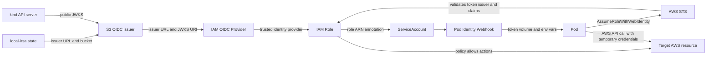
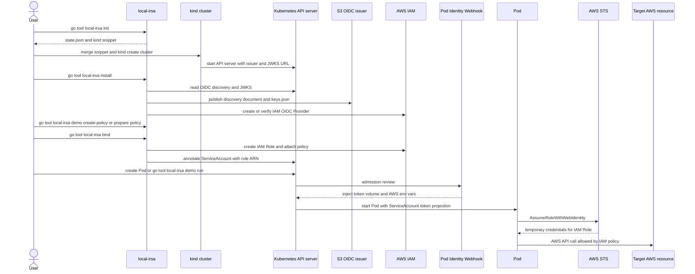

# Architecture

`local-irsa` connects a local Kubernetes cluster to AWS STS by publishing the
cluster's public ServiceAccount signing keys as an OIDC issuer and then
creating IAM resources that trust that issuer. The Pod can then call AWS
resources allowed by the IAM Role policies.



## `init`

`init` creates local state and the `kind` OIDC snippet. The state records the
AWS account ID, region, bucket name, issuer URL, and related values that later
commands need.

When `--bucket` is not set, `init` adds a random `issuerID` to the default
bucket name. This makes the issuer bucket name harder to guess.

`init` does not create AWS resources or Kubernetes resources. After `init`,
merge the printed snippet into your `kind` config. See [`init`](commands/init.md)
and [Create a kind Cluster](kind.md).

## kind Cluster Creation

You create the `kind` cluster yourself after merging the snippet. The snippet
sets the kube-apiserver issuer URL and JWKS URL:

```text
service-account-issuer: "<issuerURL>"
service-account-jwks-uri: "<issuerURL>/keys.json"
```

`local-irsa` does not set the ServiceAccount private signing key path. The
private signing key stays inside the `kind` control plane. `local-irsa` reads
only the public JWKS from the Kubernetes API.

## `install`

`install` reads local state and the current cluster OIDC data. It publishes two
public S3 objects:

```text
/.well-known/openid-configuration
/keys.json
```

The discovery document points AWS to the issuer URL and the JWKS URI. The JWKS
contains public keys only. These objects must be public read so AWS can verify
web identity tokens.

`install` also creates or checks the IAM OIDC Provider for the S3 issuer URL.
IAM trusts that provider because it represents the issuer URL in the token.
See [`install`](commands/install.md).

## `bind`

`bind` creates or updates an IAM Role and writes the role ARN to one
ServiceAccount. The trust policy restricts the role to the expected token
claims:

- `aud` must be `sts.amazonaws.com`;
- `sub` must match `system:serviceaccount:<namespace>:<serviceAccount>`.

These conditions restrict the IAM Role to one Kubernetes ServiceAccount. To
grant more AWS permissions to that ServiceAccount, attach more managed policy
ARNs to the same role. See [`bind`](commands/bind.md).

## Pod Runtime Authentication

When a Pod uses a bound ServiceAccount, the Pod Identity Webhook injects the
web identity token volume and AWS environment variables. The application or
AWS CLI in the Pod calls AWS STS with `AssumeRoleWithWebIdentity`.

AWS STS checks the token issuer against the IAM OIDC Provider, reads the public
keys from the S3 JWKS object, validates the token, checks the role trust policy
conditions, and returns temporary credentials for the IAM Role. The Pod then
uses those temporary credentials to call the target AWS resources allowed by
the attached IAM policies.

Use [Demo](commands/demo.md) to run a small AWS CLI Pod that verifies this
path.

## Command and Runtime Sequence

This sequence shows both the setup commands and the runtime AWS credential
exchange.



## Safety Model

`local-irsa` uses a few safeguards around resources that can affect account
security:

- The default bucket name includes a random `issuerID` when `--bucket` is not
  set.
- S3 operations check the expected bucket owner.
- Managed AWS resources use local-irsa ownership tags.
- Existing resources whose ownership tags do not match are not changed.
- `down --delete-bucket` deletes the S3 bucket only after the IAM OIDC
  Provider is deleted or confirmed absent.

The last rule avoids releasing an issuer bucket name while an IAM OIDC
Provider in the account still trusts that issuer URL. See [`down`](commands/down.md)
for cleanup details.
